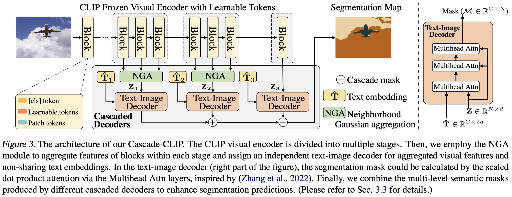

# Cascade-CLIP: Cascaded Vision-Language Embeddings Alignment for Zero-Shot Semantic Segmentation

Authors: Yunheng Li, Zhong-Yu Li, Quansheng Zeng, Qibin Hou*, Ming-Ming Cheng.

[[paper](https://arxiv.org/abs/2406.00670)] [[github](https://github.com/HVision-NKU/Cascade-CLIP)] [[pretrained models](https://github.com/HVision-NKU/Cascade-CLIP/tree/main#pretrained-models)] [[Param. \& Flops \& FPS](https://github.com/HVision-NKU/Cascade-CLIP/tree/main#Efficiency)]  [[visualization](https://github.com/HVision-NKU/Cascade-CLIP/main/figs/visualization.png)]

---

> **Abstract:** *Pre-trained vision-language models, e.g., CLIP, have been successfully applied to zero-shot semantic segmentation. Existing CLIP-based approaches primarily utilize visual features from the last layer to align with text embeddings, while they neglect the crucial information in intermediate layers that contain rich object details. However, we find that directly aggregating the multi-level visual features weakens the zero-shot ability for novel classes. The large differences between the visual features from different layers make these features hard to align well with the text embeddings. We resolve this problem by introducing a series of independent decoders to align the multi-level visual features with the text embeddings in a cascaded way, forming a novel but simple framework named Cascade-CLIP. Our Cascade-CLIP is flexible and can be easily applied to existing zero-shot semantic segmentation methods. Experimental results show that our simple Cascade-CLIP achieves superior zero-shot performance on segmentation benchmarks, like COCO-Stuff, Pascal-VOC, and Pascal-Context.* 
>
> <p align="center">
> 
> </p>


## Installation:

See [installation instructions](INSTALL.md).

## Downloading and preprocessing Dataset:

According to MMseg: https://github.com/open-mmlab/mmsegmentation/blob/master/docs/en/dataset_prepare.md

```
datasets
└── coco_stuff164k
│   ├── images
│   │   ├── train2017
│   │   └── val2017
│   ├── annotations
│   │   ├── train2017
│   │   └── val2017
└── VOCdevkit
    ├── VOC2010
    │   ├── ImageSets
    │   ├── Annotations
    │   ├── JPEGImages  
    │   ├── SegmentationClass    
    │   └── SegmentationClassContext    
    └── VOC2012
        ├── ImageSets
        ├── Annotations
        ├── JPEGImages  
        ├── SegmentationClass    
        └── SegmentationClassAug    
```
## Preparing Pretrained CLIP model:
Download the pretrained model here: clip_pretrain/ViT-B-16.pt
https://openaipublic.azureedge.net/clip/models/5806e77cd80f8b59890b7e101eabd078d9fb84e6937f9e85e4ecb61988df416f/ViT-B-16.pt

## Pretrained models:
All experiments using a machine with 4 NVIDIA RTX 3090 GPUs.
(~20 hours for COCO Inductive)

|     Dataset     |   Setting  | mIoU(S) | mIoU(U) | Traing time (hours) |Model Zoo|
| :-------------: | :---------: | :-----: | :--: |:--: |   :----------------------------------------------------: |
| PASCAL VOC 2012 |  Inductive   |   92.5 ($\pm$ 1.0)  |   83.0 ($\pm$ 1.0) | ~3|[[BaiduNetdisk](https://pan.baidu.com/s/1HZyN-Q0PFLJyaofOJ6ePqw?pwd=ji3u)] |
| PASCAL VOC 2012 | Transductive |   93.6 ($\pm$ 0.5)  |   93.2 ($\pm$ 0.5) | ~1.5|[[BaiduNetdisk](https://pan.baidu.com/s/1igggSXPOF0PXEGmxsH7NQw?pwd=45qa)] |
| PASCAL Context  | Inductive    |   55.9 ($\pm$ 0.5)  |   47.2 ($\pm$ 1.0) | ~8|[[BaiduNetdisk](https://pan.baidu.com/s/1iUTHAwDl4DROEzMQCy56Ug?pwd=yeb5)] |
| PASCAL Context  | Transductive |   56.4 ($\pm$ 0.5)  |   55.0 ($\pm$ 1.0) | ~4|[[BaiduNetdisk](https://pan.baidu.com/s/17C9a7M1SUDxcL-ufX3PY4g?pwd=wtkp)] |
| COCO Stuff 164K |  Inductive   |   41.2 ($\pm$ 0.5)  |   43.4 ($\pm$ 1.0) | ~20|[[BaiduNetdisk](https://pan.baidu.com/s/1nuSO-Gjf3j9HaJA2eRpWlg?pwd=tvgb)] |
| COCO Stuff 164K | Transductive |   41.7 ($\pm$ 0.5)  |   62.5 ($\pm$ 1.0) | ~10|[[BaiduNetdisk](https://pan.baidu.com/s/1qyCfObgTnrVwgp-i-NYUxw?pwd=kbg4)] |

Note that here we report the averaged results of several training models and provide one of them.


## Training (Inductive):
 ```shell
 bash dist_train.sh configs/coco_171/vpt_seg_zero_vit-b_512x512_80k_12_100_multi.py 4 output/coco_171/inductive

 bash dist_train.sh configs/context_59/vpt_seg_zero_vit-b_512x512_40k_12_10.py 4 output/context_59/inductive

 bash dist_train.sh configs/voc_20/vpt_seg_zero_vit-b_512x512_20k_12_10.py 4 output/voc_20/inductive
 ```

## Training (Transductive):

 ```shell
 bash dist_train.sh configs/coco_171/vpt_seg_zero_vit-b_512x512_40k_12_100_multi_st.py 4 output/coco_171/transductive --load-from=output/coco_171/inductive/iter_40000.pth

 bash dist_train.sh configs/context_59/vpt_seg_zero_vit-b_512x512_20k_12_10_st.py 4 output/context_59/transductive --load-from=output/context_59/inductive/iter_20000.pth

 bash dist_train.sh configs/voc_20/vpt_seg_zero_vit-b_512x512_10k_12_10_st.py 4 output/voc_20/transductive --load-from=output/voc_20/inductive/iter_10000.pth
 ```


## Inference:
 `python test.py config/xxx/xxx.py ./output/model.pth --eval=mIoU`

For example: 
```shell
python test.py configs/coco_171/vpt_seg_zero_vit-b_512x512_80k_12_100_multi.py  output/coco_171/inductive/latest.pth --eval=mIoU
```

## Cross Dataset Inference:
```shell
python test.py configs/cross_dataset/coco-to-voc.py output/coco_171/inductive/iter_80000.pth --eval=mIoU

python test.py ./configs/cross_dataset/coco-to-context.py output/coco_171/inductive/iter_80000.pth --eval=mIoU
```

## Efficiency
Requires fvcore to be installed

```shell
pip install fvcore

CUDA_VISIBLE_DEVICES="0" python get_flops.py configs/coco_171/vpt_seg_zero_vit-b_512x512_80k_12_100_multi.py 
```

```shell
CUDA_VISIBLE_DEVICES="0" python get_fps.py configs/coco_171/vpt_seg_zero_vit-b_512x512_80k_12_100_multi.py checkpoints/coco_171/coco_model.pth 
```
## Visualization

```shell
python test.py configs/coco_171/vpt_seg_zero_vit-b_512x512_40k_12_100_multi_st.py   output/coco_171/transductive/latest.pth --show-dir=visualization/coco_171/transductive --eval=mIoU
```

## Citation:
If you find this project useful, please consider citing:
```bibtex
@article{li2024cascadeclip,
      title={Cascade-CLIP: Cascaded Vision-Language Embeddings Alignment for Zero-Shot Semantic Segmentation}, 
      author={Yunheng Li and ZhongYu Li and Quansheng Zeng and Qibin Hou and Ming-Ming Cheng},
      journal={arXiv preprint arXiv:2406.00670},
      year={2024}
}
```

## Related Assets \& Acknowledgement

Our work is closely related to the following assets that inspire our implementation. We gratefully thank the authors. 

 - CLIP:  https://github.com/openai/CLIP
 - ZegCLIP: https://github.com/ZiqinZhou66/ZegCLIP
 

## License
Licensed under a [Creative Commons Attribution-NonCommercial 4.0 International](https://creativecommons.org/licenses/by-nc/4.0/) for Non-commercial use only.
Any commercial use should get formal permission first.
